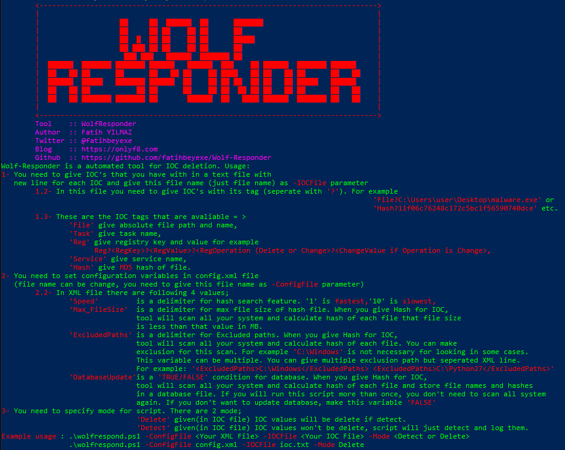
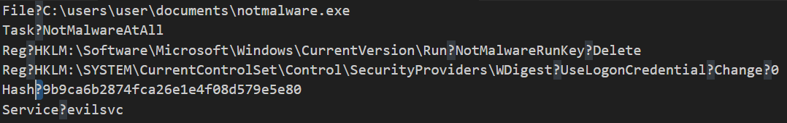
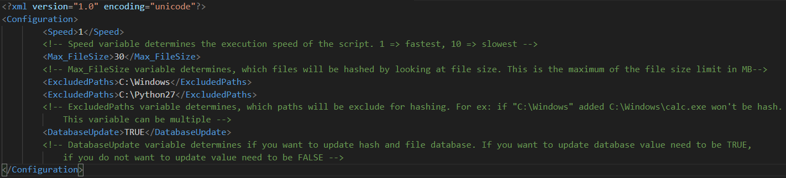

WolfResponder
===============

Introduction
------------
WolfRespond is a PowerShell v5.0+ compatible PowerShell IOC deletion tool.

Background
----------
In one of our Incident Response cases, we need to do remediation for our customer's servers. We think we need a tool that automatically delete all of IOC that we specify on the systems because connecting each machines and delete IOC's on that computer is a tiring process. I decided to create a Responder tool that help security researchers and analysts in remediation step.

First of all, I wrote a basic script that delete files, tasks and registries after deletion scripts logs all actions in a file seperated with comma. When we replace all newline character for each machines logs, we had a nicely CSV file for each machine that include which IOC detect and delete for the system. 

After a while I decided to develop that script much more. I added some extra features with help of my friends (Ahmet A. GÜLTEKİN & Gökhan AYDIN) and script took its final form. Script will continue to develop from now on.

Purpose
-------
While doing remediation step for endpoints if you do not have a skillful EDR or XDR tool (or any management tool), you have connect each machine and delete your findings. This tool take IOC's and configurations for your endpoints and then scan all your systems and delete (if you want) IOC's on each endpoint. Long story short, purpose of the tool is to speed up analysts and researchers remedation process.

Usage Scenarios
-----

1- You can run script with 'Delete' mode for delete IOC's on the system for final remediation process.

2- You can run script with 'Detect' mode for detect your IOC's on the system or just for creating hash database for all your files which less or equal file size that you specify. This use case may be helpful for logging your files and hashes for specific systems. Filename and hash database file located 'C:\ProgramData\WolfResponder.db' (It's just a newline seperated values, not db :D ).

3- You can run script with 'Detect' mode for detect your IOC's and prepare your remediation step to specify which endpoint is compromised. 

May be there are more usage scenarios for that tool but not known now. Users who use that tool can increase that scenarios. Please share your experience with the script. 

IOCFile
-----

1. You need to fill IOC's manually (maybe for your incident) in a text file with newlines and give parameter as -IOCFile. 

2. You need to seperate IOC type and IOC value with '?'. 
3. When giving Registry IOC values; use shortened version of root key (HKCU instead of HKEY_CURRENT_USER) and type ':' after root key name. You can see example of that usage above screenshot. 
4. You can delete or change a registry value; if you want to delete a registry value=> 

"Reg?[Registry Key]?[Registry Value]?[Delete]". 

If you want to change a registry value => 

"Reg?[Registry Key]?[Registry Value]?[Change]?[New value]".

5. When giving Hash value you need to give MD5 value of file.

ConfigFile
-----

You need to fill a config file for script configuration. 

Features
-----

1. File delete (with name), if given file is part of process script will kill it, if given file is part of service script will delete this service, if given file is part of task script will delete this task and log all of this behaviour(File detect as part of task and task deleted etc.).
2. Registry value delete and change.
3. Task (with name) delete. (Task name and command lines search with regexes. Take your own risk when giving task name. Don't give generic names)
4. Service (with name) delete.
5. Hash search and delete. If the hash value given as IOC is detected in more than one file all files will be delete and logged.
6. All steps (deleted, couldn't find, detected etc.) will log on text file in script folder named "[Machine name]_runtimeLog_HH_mm_dd_MM_yyyy.txt".

Extra Usage Scenario
-----
You can zip all of files (config file, ioc file and script) with zip algorithm and drop each servers. After dropped you can run below command and after a while (depends to your configuration) you can connect and take logs (runtime log and database file).

"Add-Type -AssemblyName System.IO.Compression.FileSystem;[System.IO.Compression.ZipFile]::ExtractToDirectory("[Your zip absolute path]","C:\\"); Start-Sleep -Seconds 3; cd "C:\\[Zip Name]\"; .\wolfresponder.ps1 [Script Arguments]"

Thanks to
-----

I would like to thank [Ahmet A. GÜLTEKİN](https://www.linkedin.com/in/ahmetgultekin12/)  and [Gökhan AYDIN](https://www.linkedin.com/in/gkhn-ydn/) for giving me ideas during this process.

Release Notes
-----

v1.1.0 27.01.2024 => Now also compatible for PowerShell 4.0+ and some bug fixes. (Please share your experience with tool. Contact me freely from my contact addresses)
 
